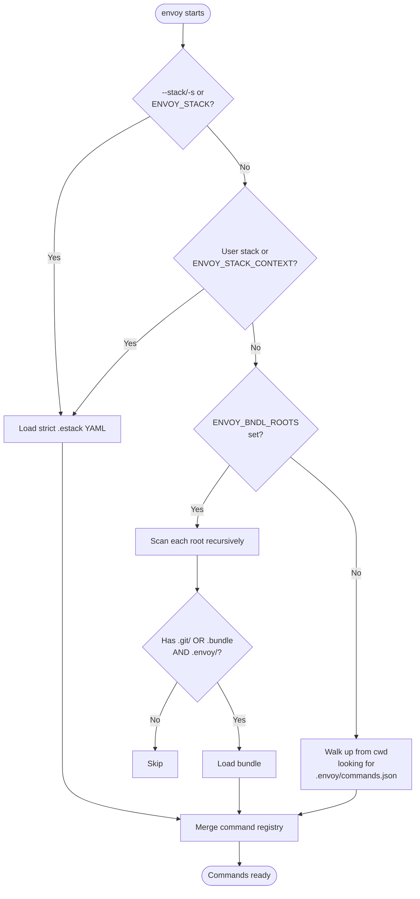
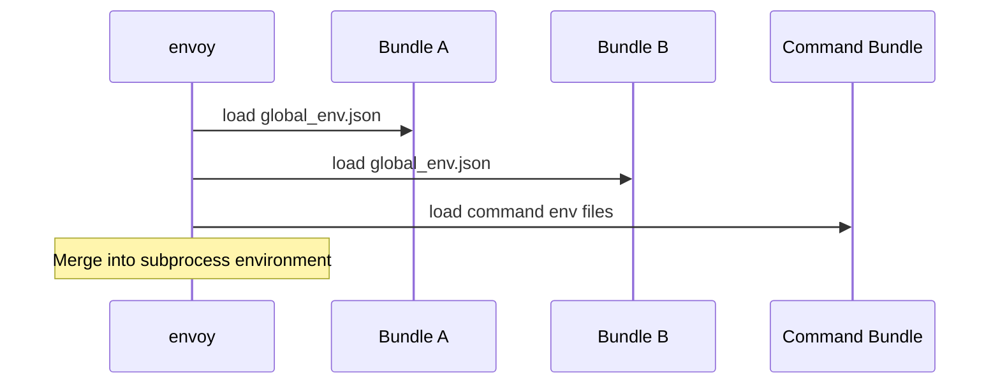
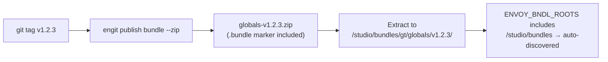

# Bundle Discovery

Envoy discovers commands from one or more **bundles** — directories containing an `.envoy/` directory. Commands from all discovered bundles are merged into a single registry.

Discovery scans directories in parallel and caches results on disk for a few
seconds so repeat invocations in a short loop don't re-scan from scratch.
Set `ENVOY_DISABLE_DISCOVERY_CACHE=1` to force a fresh scan every time.

Bundles come in two forms:

| Form | Marker | `version` | `is_production` |
|------|--------|-----------|-----------------|
| **Checkout** | `.git/` directory | `'checkout'` | `False` |
| **Published** | `.bundle` file | e.g. `'v1.2.0'` | `True` |

Published bundles are also checked against the local [bundle cache](concepts.md#bundle-cache): if a cached snapshot exists for a published bundle's `namespace:name`, envoy uses the cached copy instead of re-reading it from its original (possibly remote) location. Checkout bundles are never substituted this way — your own working copy is never silently swapped for a cached snapshot.

## Discovery Flow



## Method 1 — Auto-Discovery via `ENVOY_BNDL_ROOTS`

Set `ENVOY_BNDL_ROOTS` to a semicolon-separated list of root directories. Envoy scans each root recursively for subdirectories that have an `.envoy/` directory and either a `.git/` directory (checkout) or a `.bundle` marker file (published bundle).

=== "PowerShell"

    ```powershell
    $env:ENVOY_BNDL_ROOTS = "R:/repo/gtvfx-envoy;R:/studio/bundles"
    ```

=== "cmd"

    ```batch
    set ENVOY_BNDL_ROOTS=R:/repo/gtvfx-envoy;R:/studio/bundles
    ```

=== "Unix/macOS"

    ```bash
    export ENVOY_BNDL_ROOTS=/home/user/repos:/opt/studio/bundles
    ```

### Example structure — mixed checkout and published bundles

```
/studio/bundles/
├── gt/
│   ├── globals/         ← .bundle + .envoy/ ✓ discovered (production v1.0.0)
│   └── pythoncore/      ← .bundle + .envoy/ ✓ discovered (production v2.1.0)
/workspace/repos/
└── gtvfx-envoy/
    └── gt/
        └── my-tool/     ← .git/ + .envoy/ ✓ discovered (checkout)
```

!!! note
    The scan walks up to 5 directory levels deep per root. Point roots at the repository workspace (e.g. `R:/repo/gtvfx-envoy`).

## The `.bundle` Marker File

Every bundle published through
[Envoy Utils](https://github.com/gtvfx-envoy/envoy_utils) contains a
`.bundle` file at its root. This file serves two purposes:

1. **Discovery marker** — `ENVOY_BNDL_ROOTS` scanning accepts it alongside `.git/` so deployed bundles are auto-discovered without a Stack.
2. **Version metadata** — `Bundle.version` and `Bundle.is_production` read from it.

### Format

```json
{
  "name": "globals",
  "version": "v1.0.0",
  "published": "2026-06-21T10:13:00+00:00"
}
```

After extracting a published zip under a bundle root, envoy discovers it automatically — no `studio.estack` required.

## Method 2 — Runtime Stack

Create a strict YAML `studio.estack` and pass it with `--stack` / `-s`:

The `.estack` filename stem is the Stack name; the YAML document does not
declare a separate name.

```yaml
namespace: gt
source:
  type: local
pinned_version: null
metadata:
  owner: tools
bundles:
  - path: ${REPO_ROOT}/gt/globals
    metadata:
      role: core
  - path: ${REPO_ROOT}/gt/pythoncore
  - path: ${TOOLS_ROOT}/gt/envoy/v1.0.0
```

```console
en --stack /studio/stacks/studio.estack --list
en -s /studio/stacks/studio.estack python script.py
```

Stack files must have the exact `.estack` extension. Unknown fields, duplicate
paths, missing paths, malformed YAML, and directories that are not valid envoy
bundles are errors. Relative paths resolve from the stack file's directory.

### Environment variables in stack paths

Bundle paths inside a stack support `${VARNAME}` and `~` expansion.
Each token is resolved against the current process environment at load time,
making Stacks portable across machines or deployment roots:

```yaml
namespace: studio:production
bundles:
  - path: ${STUDIO_ROOT}/envoy/0.2.1
  - path: ${STUDIO_ROOT}/globals/1.0.0
  - path: ${STUDIO_ROOT}/pythoncore/2.1.0
```

When envoy loads this Stack it replaces each `${VAR}` with the matching
environment variable value before resolving the path.

An undefined variable is a validation error; envoy never constructs a partial
runtime from a malformed stack.

!!! tip
    This is the same `${VARNAME}` syntax used in `.envoy/*.json` files.

## Method 3 — Local Fallback

If no bundles are found via the above methods, Envoy walks up from the current directory looking for `.envoy/commands.json`. This allows running from inside a single-bundle project without any setup.

## `global_env.json`

Any bundle may contain `.envoy/global_env.json`. It is loaded automatically before every command's env files, regardless of which bundle the command comes from.

In multi-bundle mode, `global_env.json` is collected from **every** discovered bundle in discovery order:



## Command Conflicts

When two bundles define the same command name, the **last loaded bundle wins**:

```
WARNING - Command 'python' from gt:bundle-b overrides existing command from gt:bundle-a
```

Use `--verbose` to surface these warnings and adjust bundle order in your stack or `ENVOY_BNDL_ROOTS` to control priority.

## Local Bundle Overrides

`--override-bundle BNDLID=PATH` (short: `-o`) substitutes a local checkout
for a bundle that was already discovered via a Stack or `ENVOY_BNDL_ROOTS`,
without hand-writing a custom Stack file for a one-off local change:

```powershell
en -o gt:maya=R:/dev/maya --stack studio python script.py
```

It only ever swaps the root path of a bundle the Stack or discovery process
already found -- it can't inject a bundle that wasn't otherwise part of
resolution. See the [CLI reference](cli-reference/envoy.md#--override-bundle---o) for the full flag details and error behavior.

## Environment Variables

| Variable | Separator | Description |
|---|---|---|
| `ENVOY_STACK` | — | Named Stack or `.estack` path |
| `ENVOY_STACK_CONTEXT` | — | Colon-separated context for registry matching |
| `ENVOY_STACK_ROOTS` | `;` (Windows) / `:` (Unix) | Named Stack registry roots |
| `ENVOY_BNDL_ROOTS` | `;` (Windows) / `:` (Unix) | Root directories to scan for bundles |

## Published Bundle Workflow



`Bundle.version` returns `'checkout'` for git checkout bundles and the semver string (e.g. `'v1.2.0'`) for published bundles that carry a `.bundle` marker.
